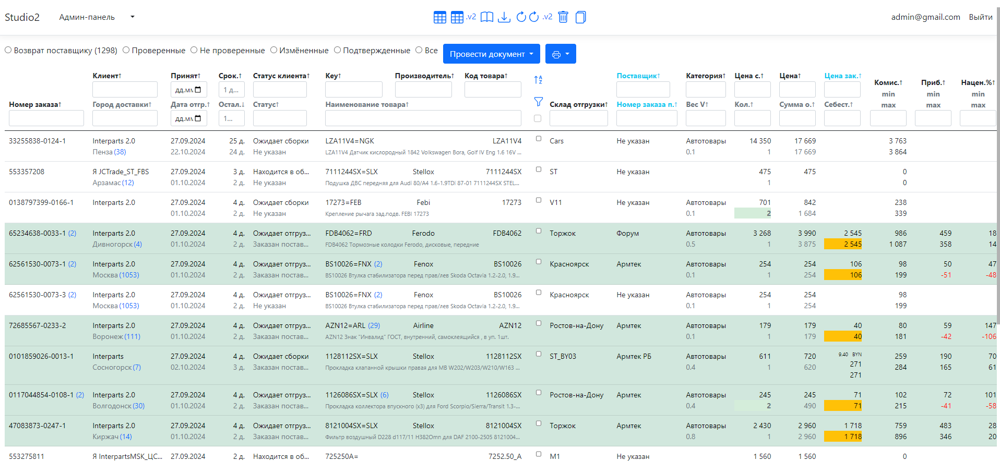
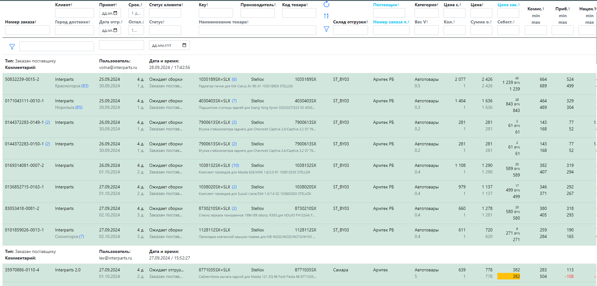
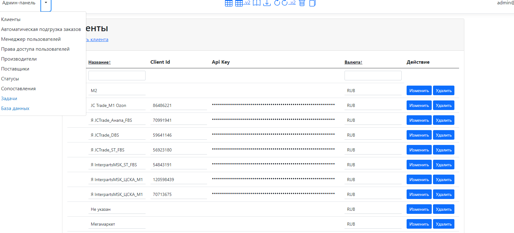
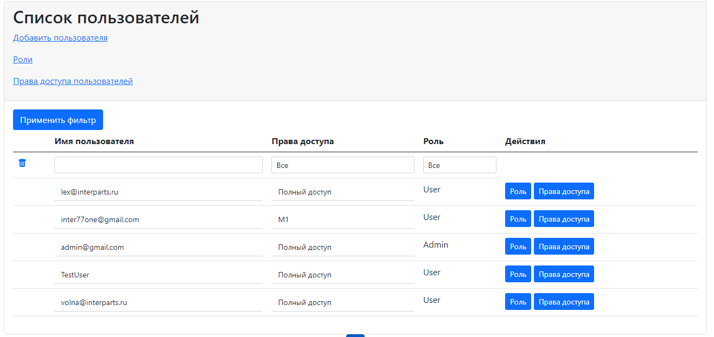
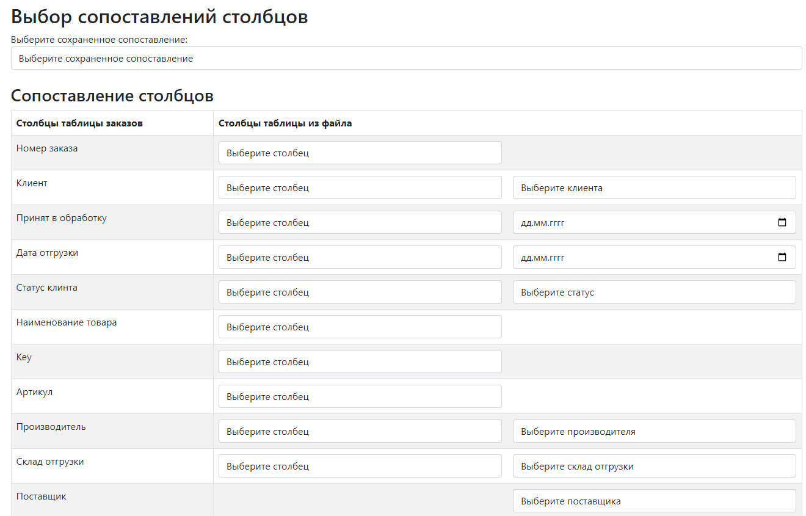
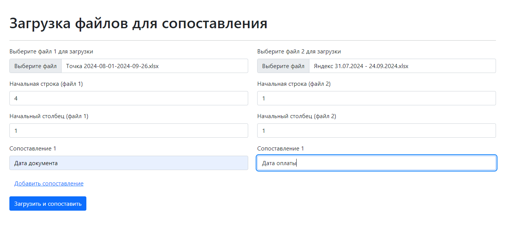
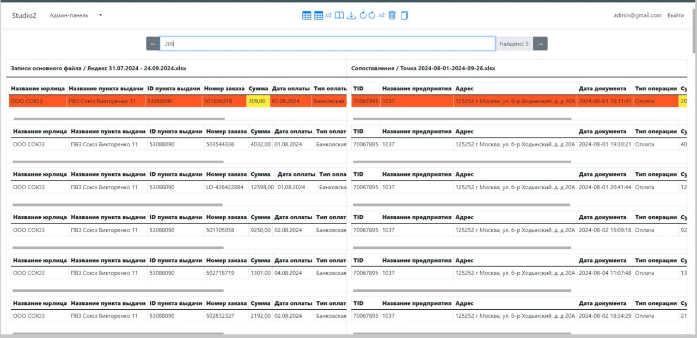

# CRM система для менеджмента заказов маркетплейсов

## Описание
Эта CRM-система предназначена для управления поставками и заказами с маркетплейсов, таких как **Ozon** и **Яндекс Маркет**. Система предоставляет функционал для обработки заказов, управления статусами, администрирования пользователей и номенклатуры, а также импорта данных и учета оплат. Ниже описаны основные возможности системы.

## Используемые технологии

- **.NET ASP MVC** — для разработки веб-приложения.
- **Entity Framework** — для работы с базой данных.
- **Hangfire** — для управления фоновыми задачами.
- **Blazor** — для создания интерактивных пользовательских интерфейсов.
- **MS SQL** — для хранения и управления данными.

## Подключенные API

- **API Яндекс Маркета** — интеграция с системой заказов **Яндекс Маркет**.
- **Ozon Seller API** — для управления заказами и статусами на платформе **Ozon**.
- **Dropbox API** — для импорта данных и хранения файлов.
- **Interparts.store API** — для интеграции с системой запасных частей.

## Основные функции

### 1. Работа с заказами маркетплейсов
- Поддержка работы с заказами из **Ozon** и **Яндекс Маркет**.
- Просмотр актуальности заказов и обновление статусов.
- Возможность перевода заказов в новый статус.
- История изменений и операций с заказами.

### 2. Администрирование и управление номенклатурой
- Обширная административная панель для управления системой.
- Справочники различных категорий номенклатуры.
- Управление пользователями и назначение ролей.

### 3. Импорт заказов из файлов
- Поддержка импорта заказов через файлы (CSV, Excel и др.).
- Возможность сопоставления полей для корректной интеграции данных.

### 4. Учет оплат заказов
- Отдельный модуль для учета и контроля оплаты заказов.
- Поддержка работы через мобильное приложение для финансового учёта.

